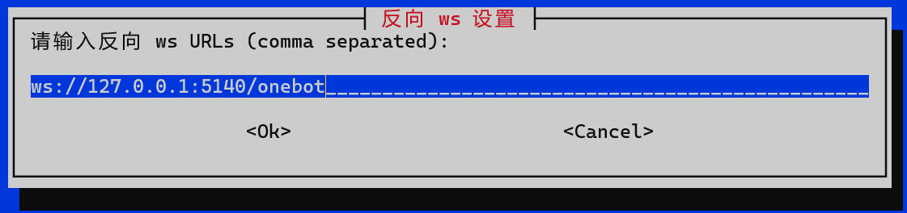

# Koishi-Termux 接入 NapCat-Termux

## 1. 安装 Koishi ([koimux_bot](https://github.com/initialencounter/koimux_bot))
在 Termux 终端中执行下面的脚本
```shell
bash -c "$(curl -L https://gitee.com/initencunter/koimux_bot/raw/master/script/koishi.sh)"
```

启动 Koishi
```shell
koi start
```

## 2. 安装 NapCat-Termux

按音量下键，点击`切换会话` -> `新会话` -> `点击切换新创建的会话`
在新的终端中执行下面的脚本
```shell
bash -c "$(curl -L https://github.com/NapNeko/NapCat-Termux/raw/main/onekey.sh)"
```

## 3. 扫码登录

```shell
# 启动容器后会自启
bash bookworm-arm64.sh
```
修改NapCat配置


扫码登录

## 4. 接入 Koishi

浏览器打开 `http://127.0.0.1:5140`

[接入 Koishi](https://napneko.github.io/zh-CN/guide/integration)