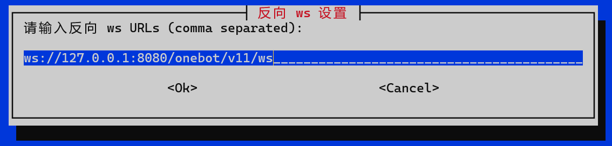

# Nonebot 接入 NapCat-Termux

## 1. 安装 Nonebot
在 Termux 终端中执行下面的脚本
```shell
pkg updage
# 一路回车
pkg i python3
## 这一步可能会报错，考虑在 proot 容器内安装 Nonebot
python3 -m pip install nb-cli
nb create
```

启动 Nonebot
```shell
nb run
```

## 2. 安装 NapCat-Termux

按音量下键，点击`切换会话` -> `新会话` -> `点击切换新创建的会话`
在新的终端中执行下面的脚本
```shell
bash -c "$(curl -L https://github.com/NapNeko/NapCat-Termux/raw/main/onekey.sh)"
```

## 3. 扫码登录

```shell
# 启动容器后会自启
bash bookworm-arm64.sh
```
修改NapCat配置


扫码登录

## 4. 接入 Nonebot

浏览器打开 `http://127.0.0.1:5140`

[接入 Nonebot](https://napneko.github.io/zh-CN/guide/integration)